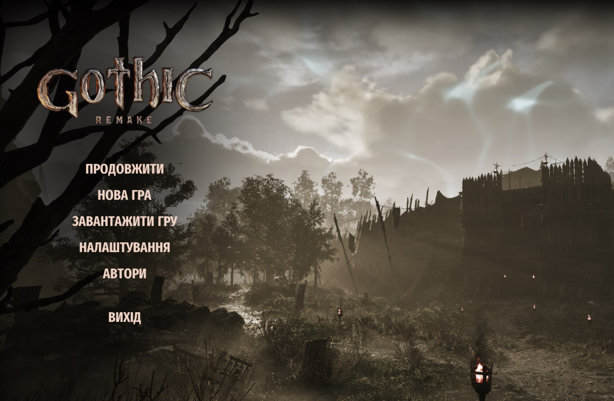
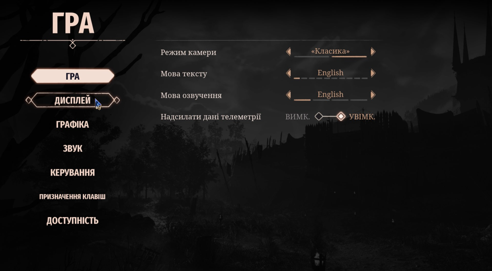
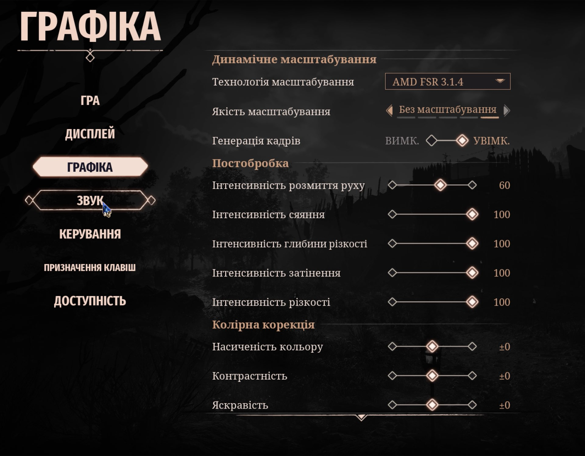
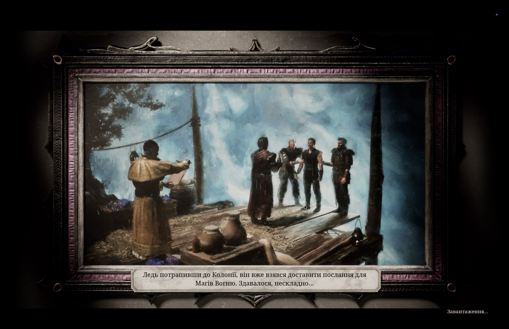
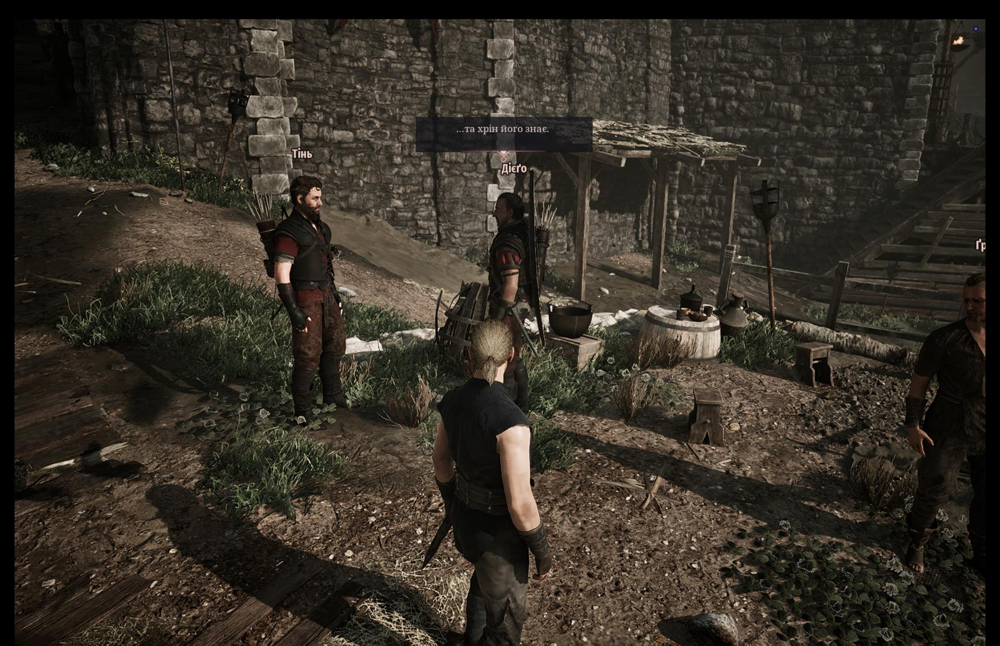
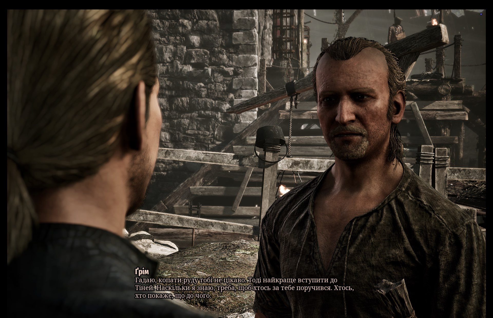
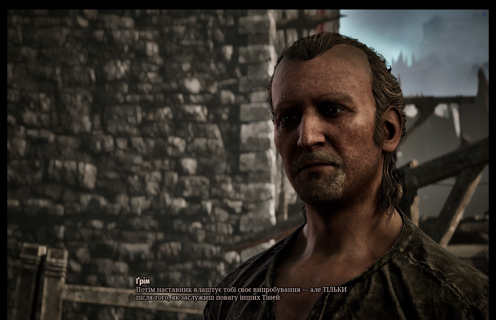
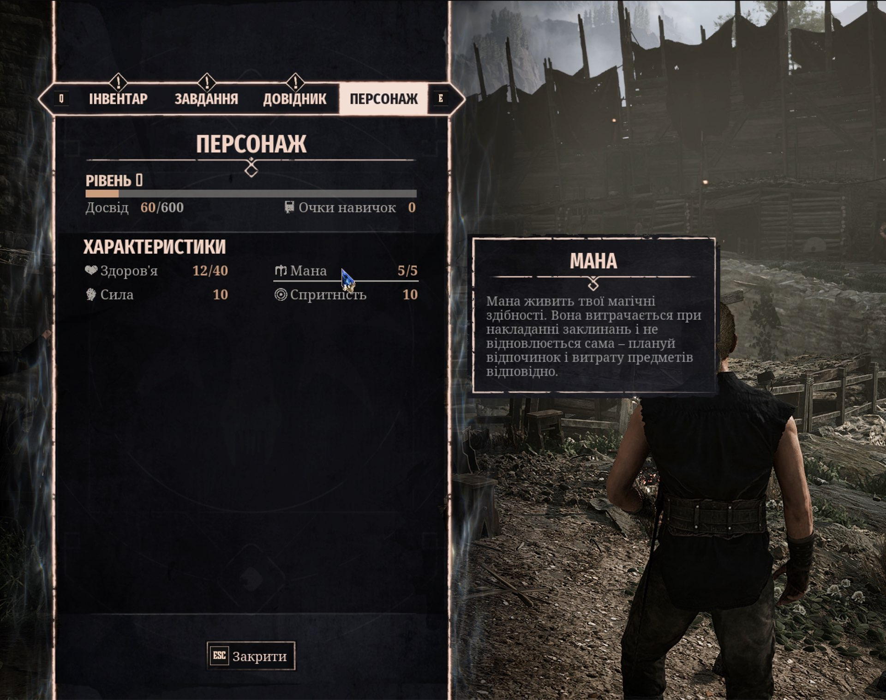
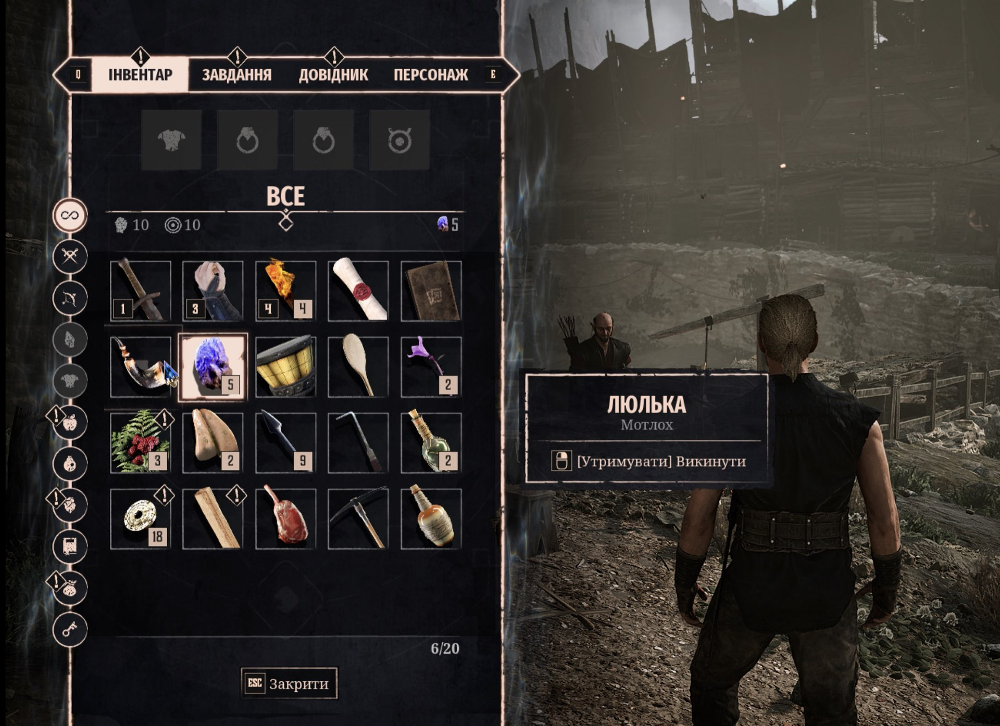

# Gothic 1 Remake — Українська локалізація (Biozahard Edition)

**ШІ-агентний переклад** Gothic 1 Remake українською — з визначеним пайплайном якості, глосарієм і редакційними стандартами.

**Версія:** 1.3  
**Оновлено:** 2026-06-22  
**Сумісна версія гри:** 1.0.0 - 1.0.2  
**Рядків перекладено:** 50 478 / 50 478 (100%)  
**Статус:** Готово до гри

---

## Як зроблений переклад

Переклад зроблений за допомогою мережі АІ-агентів перекладачів що дуже вмотивовано розбиралися в тому що відбувається в світі гри і друг друга контролювали =)

В цьому перекладі ми бачимо результат в якому:

- Кожен рядок перекладено з урахуванням контексту квесту, персонажа і ситуації
- Єдиний глосарій з 556 затверджених термінів
- Голосові профілі NPC — Diego, Gomez, Thorus та інші говорять у власному стилі
- Незалежний агент-рецензент після кожного блоку
- Автоматичний QA: плейсхолдери, теги, форматування, полівні форми

---

## Пайплайн

1. **Lore-gathering** — збір лору: географія колонії, фракції, персонажі, ранги, магічна система
2. **Glossary & canon** — кросмовний аналіз (EN/DE/FR/PL та ін.) для кожного терміна, затвердження канонічних форм
3. **Context packs** — побудова контекстних пакетів per-block: хто говорить, де, що відбулося до цього
4. **Translation** — переклад чанками через AI-агентів з перевіркою кожного рядка за EN-джерелом та глосарієм
5. **Review** — незалежний агент-рецензент перевіряє кожен блок: цілісність тегів, відповідність глосарію, граматику, регістр
6. **QA** — детерміністичні перевірки скриптами: `{placeholders}`, `%s/%d`, `<tags>`, `\n`, полівні форми

---

## Встановлення

**Крок 1.** Зробіть резервну копію оригінального файлу локалізації (на випадок якщо захочете відкотити):
```
G1R/Story/Cache/AlkimiaLocalization_00000000.lcache  →  ...lcache.bak
```

**Крок 2.** Розпакуйте `G1R-UA-By-Biozahard.zip` у корінь гри (туди, де лежить папка `G1R/`):

- **Windows (Steam):**
  ```
  C:\Program Files (x86)\Steam\steamapps\common\Gothic 1 Remake\
  ```
- **Mac (CrossOver/Steam):**
  ```
  ~/Library/Application Support/CrossOver/Bottles/Steam/drive_c/Program Files (x86)/Steam/steamapps/common/Gothic 1 Remake/
  ```

Архів має структуру `G1R/Story/Cache/AlkimiaLocalization_00000000.lcache` — файл стане на місце автоматично.

**Крок 3.** Запустіть гру та встановіть:
```
Settings → Language → Text: English
```

> Переклад записано в EN-слоти файлу, тому мова тексту має бути **English**.

---

### Видалення

Скопіюйте `.bak`-бекап назад — або перевстановіть гру через Steam (Verify integrity of game files).

---

## Що перекладено

| Розділ | Рядків |
|--------|--------|
| Voiceline (озвучені репліки) | 24 851 |
| Quest journal (квести/журнал) | 12 786 |
| Dialogue (діалоги NPC) | 6 363 |
| Misc (системне, підказки) | 3 416 |
| Item (предмети) | 1 032 |
| UI (інтерфейс) | 942 |
| Book (книги, записки) | 732 |
| Debug / injectable (службові рядки) | 334 |
| Location (назви локацій) | 19 |
| Creature (назви істот) | 3 |
| **Всього** | **50 478** |

---

## Відомі обмеження

- Аудіо залишається оригінальним (EN) — переклад тільки тексту
- Відеоролики не локалізовані
- Деякі UI-рядки можуть обрізатись залежно від розміру шрифту — повідомляйте через Issues

---

## Знайшли помилку?

Відкривайте [Issue](../../issues) і вкажіть:
- Де в грі (квест / локація / NPC)
- Що написано і що не так
- Скріншот якщо є

---

## Скріншоти











---

## Credits

- **Biozahard** — переклад, глосарій, лор, QA, пайплайн
- **AI-агенти:** Claude (Anthropic), Kiro, Codex — translation workers у багатоагентному пайплайні
